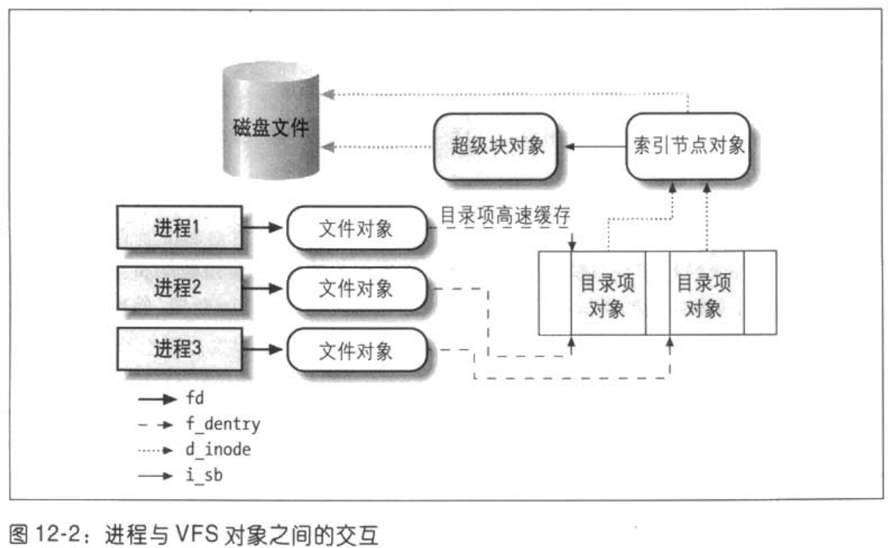

# VFS
虚拟文件系统-Virtual Filesystem,引入通用文件模型的数据结构，解决多个文件系统的统一操作调度接口，同时引入磁盘高速缓存操作软件机制（目录项高速缓存，页高速缓存）提高系统性能。

## 通用文件模型组成对象类型

### 超级块对象 superbock object
存放已安装的文件系统相关信息，该对象对应于磁盘上的文件控制块
### 索引节点对象 inode object
存放具体关于文件的信息对象，该有一个索引节点号，是文件系统的编号标示，具有唯一性，且连接着超级块对象
### 文件对象 file object
用于描述进程与打开的文件交换的对象

### 目录项对象 dentry object
文件的特别名称，与对应的文件进行链接的有关信息，每个文件系统都有自己特定的方式将这些信息归类存入硬盘上。
#### 对象字段
#### 状态
#### 操作函数
#### 目录项高速缓存

### VFS所处理的系统调用

## 支持的文件系统类型
- 磁盘文件系统
  - 管理本地磁盘分区中可存储空间或者起到磁盘作用的设备，linux支持的有：
    - Linux使用的Ext2(Second Extended Filesystem),Ext3(Thrid Extended Filesystem),ReiserFS
    - UNIX文件系统：
      - sysv文件系统:SystemV,Xenix,Coherent
      - UFS:BSD,solaris,NEXTSTEP
      - MINIX
      - VERITAS VxFS：unixWare
    - 微软文件系统：MS-DOS,VFAT,NFAT
    - ISO960 CD-RAM和通用磁盘格式UD（UDF）DVD文件系统
    - 其他：
      - IBM OS/2 HPFS
      - 苹果的Macintosh HFS
      - Amiga 快速文件系统 AFFS
      - Acorn 磁盘文件归档系统 ADFS
- 网络文件系统
- 特殊文件系统

## 文件系统处理
## VFS系统调用的实现
## 文件锁