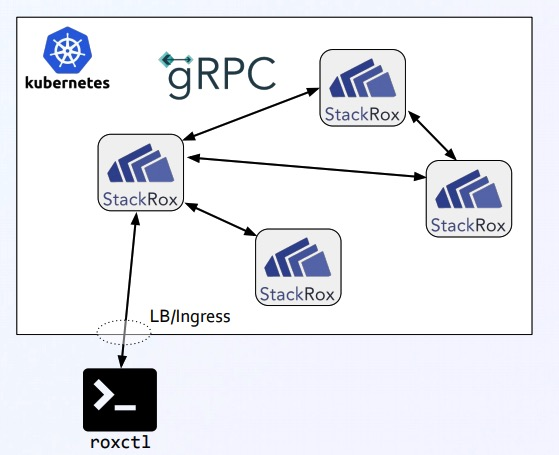

# 漫谈 Go-gRPC 服务 穿过 HTTP/1
> Malte Isberner
> Managing Director, StackRox GmbH, Bochum, Germany
> Principal Engineer, StackRox Inc., Mountain View, USA
> gRPC Conf 2020 - July 27, 2020

## 概述
1. [问题现状](./gRPCServicesViaHttp1.md#问题现状)
2. [为什么gRPC要求HTTP/2](为什么gRPC要求HTTP/2)
3. gRPC-Web 与降级
4. Go Library:实现&例子
5. 结语

## 问题现状
微服务部署在k8s上时，CLI与service使用gPRC互时时，通过LB存在的问题：
- gRPC基于http/2
- 许多LB并不支持http/s,跟多是7层lb,例如AWS ALB
- 支持参数
  - 只支持TCP lb,例如TLS-passthrough
  - 支持端对端的http/2 的lb
    - A.o GCP HTTP/2
    - nginx1.13.10+
    - HAproxy1.9.2+
  - Envoy 使用gRPC HTTP/1.1 网桥
- 技术可信性不等于现实可信性，不能让用户不实用ALB而去使用TLS 穿透w/0 管理证书

### 功能要求
- 在roxctl CLI 用其他技术上替代gRPC和HTTP/1.1网络交互
- 兼容性要求：
  - 新版本CLI和server应该工作在非兼容的gRPC LBs上
  - 新/老 和老/新的这种组合时，可以工作在兼容性gRPC LBs上，不能一起使用不同的RPC协议

## 为什么gRPC 要求 HTTP/2
### HTTP/2和HTTP/1,1区别
- HTTP/2 二进制传输，HTTP/1,1是文本
- HTTP/2 同域名下一个连接承载多个请求流
- HTTP/2 客户端全双工流式交互
- HTTP/2 和HTTP/1.1 都可以支持trailers
- HTTP/2 服务端可以主动推送
### Client Streaming
- HTTP/1:
  - 客户端发送请求格式(头部+body,body可能为空)
  - 响应格式(头部+body,body可能为空)
- HTTP/2:
  - 客户端发送请求头部
  - 接下来都可能同时发生
    - 客户端发送请求body,chunks/streaming 形式
    - 服务端发送请求头部，后面紧接响应体,chunks/streaming 形式
  - 服务端发送trailers和主动关闭流
- 客户端和服务端请求流程方式
  - HTTP/1：客户端发送，服务端响应
  - HTTP/2: 客户端开始发送，在客户端请求结束之前，服务端可能开始响应
- 要求客户端请求流和全双工流RPC调用
- HTTP/1无法支持客户端请求流，但是roxctl CLI只使用单一RPC调用
### Trailers
- Trailers: 服务端发送元数据在响应体之后
  - 推迟头部
  - 典型例子：checksum响应体
  - gRPC例子：响应状态/错误信息
- HTTP/1.1把Trailer 数据作为响应体部分进行模拟
## gRPC-Web 与降级
### gRPC-Web
- 替gRPC设备交替传输spec到web客户端
- 支持单一，服务端流式RPCs，不支持客户端流式和双向流式
- 在响应体中添加trailers作为部分内容，使用特殊编码
gRPC-web并不能解决HTTP/1，HTTP/2网络互连问题：
- 没有 Golang版本的客户端库
- 不能依靠客户自己去设置Enovy代理
- 使用其他代理可能会破坏兼容性问题
### 降级-Solution
#### Automatic gRPC-Web Downgrading

## Go Library:实现&例子
## 结语

# Article
- [Talking to Go gRPC Services via HTTP/1](https://static.sched.com/hosted_files/grpcconf20/c9/TalkingToGoGRPCviaHTTP1-gRPCConf2020-MalteIsberner.pdf)