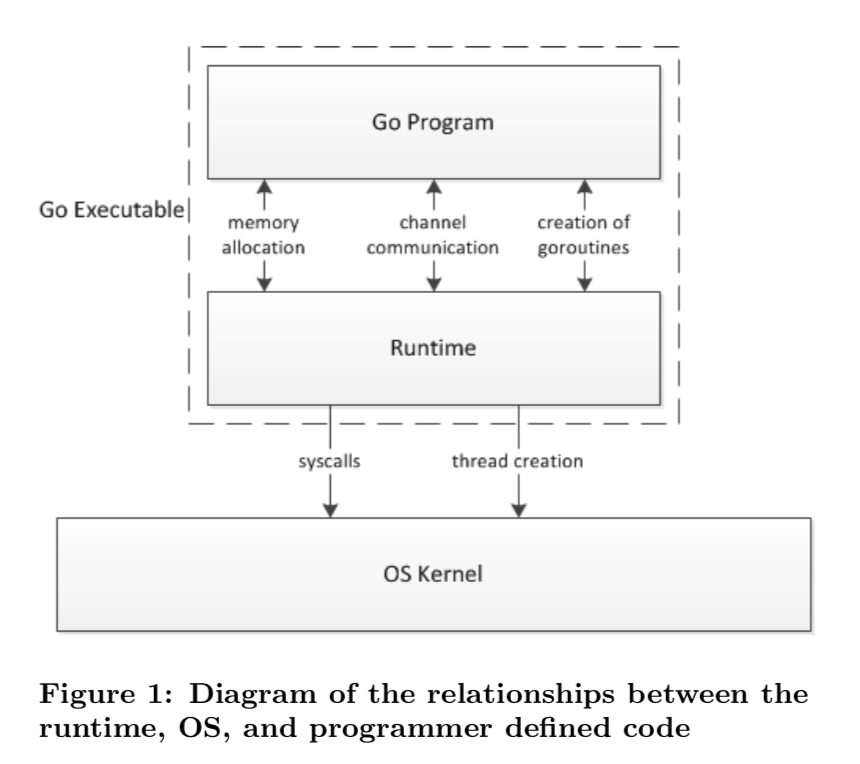

# sheduler
Go 程序执行有两层，Go Program(用户程序)，Runtime

Runtime为Go Program提供内存分配，channel通信，g的创建，GC等，Runtime则是运行在系统线程上

## sheduler 核心思想
在kernel thread 上调度goroutines
- 循环利用thread&限制goroutine-running thread 数量N,N等同与CPU核数
- 支持高并发:thread使用独立的运行队列,保持他们的平衡
- 相似的负载率，例如N个核心：每个核心使用一个运行队列，让thread自旋

## 底层原理
操作系统层面来看，所有的程序都是在线程上执行，runtime只是层面上的逻辑概念，将goroutines调度到线程上执行，分别由核心结构体sched，纵览，g，m，p分工合作进行：
- g：代表goroutine，有自己的栈和运行时的gobuf用来存放当前goroutine的状态，运行指令地址和其他相关数据
- m: 
- p