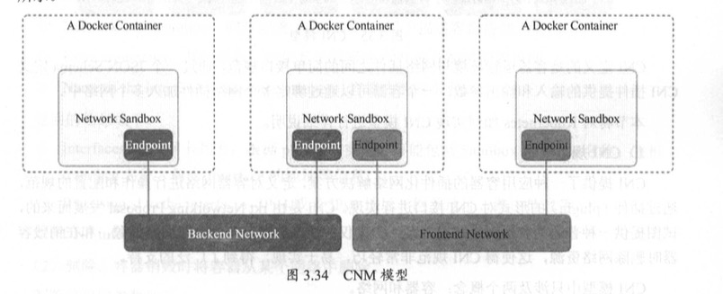
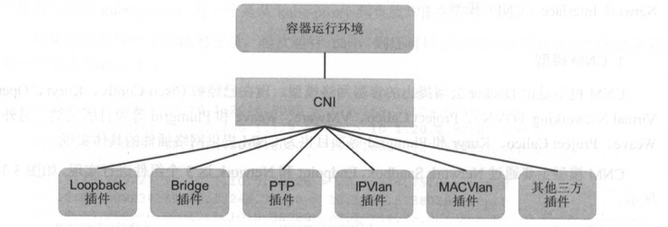

# CNI 网络模型
目前主流的容器网络模型主要有 Docker 公司提出的 Container Network Model CCNM)模型和 CoreOS 公司提出的 Container NetworkInterface (CNI)模型。

## CNM模型
CNM 模型是由 Docker 公司提出的容器网络模型，现在己经被 Cisco Contiv、 Kuryr、 Open VirtualNetworking (OVN)、 ProjectCalico、 VMware、 Weave和 Plumgrid等项目所采纳。
Weave、 Project Calico、 Kuryr 和 Plumgrid 等项目也为 CNM 提供网络插件的具体实现。

- Network Sandbox: 容器内部的网络拢 ，包括网络接 口、路由表、 DNS 等配置的管理。Sandbox 可用 Linux 网络命名空间、 FreeBSD Jail 等机制进行实现。一个 Sandbox 可以 包含多个 Endpoint。
- Endpoint:用于将容器内的 Sandbox 与外部网络相连的网络接口。可以使用 veth 对、 Open vSwitch 的内部 po约等技术进行实现。一个 Endpoint仅能够加入一个 Network。
- Network:可以直接互连的 Endpoint 的集合 。 可以通过 Linux 网桥、叽AN 等技术进行实现。一个 Network包含多个 Endpoint。

## CNI 模型
CNI 是由 CoreOS 公司提出的另一种容器网络规范,现在已经被 Kubemetes、 r怡、 Apache Mesos、 Cloud Foundry和 Kurrna等项目采纳 。 
Contiv Networking, Project Calico、 Weave、 SR-IOV、 Cilium、 Infoblox, Multus、 Romana、 Plumgrid和 Midokura等项目也为 CNI提供网络插 件的具体实现.

**CNI定义的是容器运行环境与网络插件之间的简单接口规范，通过一个月ON Schema定义CNI 插件提供的输入和输出参数** 一个容器可以通过绑定 多个网络插件加入多个网络中.

### CNI规范概述
CNI定义对容器网络进行操作和配置的规范， 通过插件(plugin)的形式对 CNI 接口进行实现 。由`rktNetworking Proposal`发展而来。
CNI 仅关注在创建容器时分配网络资源，和在销毁容 器时删除网络资源。其中容器和网络：

- 容器( Container) ：容器是拥有独立 Linux 网络命名空间的环境，是加入网络必要条件
- 网络(Network) : 网络表示可以互连的一组实体，这些实体拥有各自独立、唯一的 IP 地址 。实体可以是容器、物理机或者其他网络设备 (比如路由器) 等。

### plugin
CNI 插件包括两种类型:CNI Plugin和 IPAM(IPAddress Management)Plugin：
- CNI Plugin负责为容器配置网络资源
- IPAM Plugin 负责对容器的 IP 地址进行分配和管理

### CNI Plugin详解
CNI Plugin 包括 3 个基本接口的定义: 添加 (Add Container to Network)、删除 (Delete Container from Network)和版本查询( ReportVersion)：
- 添加 (Add Container to Network)：在 ContainerRuntime创建容器时，先创建 好容器内的网络命名空间，调用CNI插件为该netns进行网络配置，最后启动容器内的进程，参数如下：
  - Version: CNI 版本号 。
  - Container ID: 容器 IDo
  - Network namespace path:容器的网络命名空间路径，例如/proc/[pid]/ns/net.
  - Network configuration:网络配置 JSON文档，用于描述容器待加入的网络。
  - Extra ar阴ments: 其他参数 ，提供基于容器 的 CNI 插件简单配置机制 。
  - Name of the interface inside the container:容器内的网卡名 。
  返回参数：
  - Interfaceslist:网卡列表，根据 plugin的实现，可能包括 SandboxInterface名称、主机Interface名称、每个 Interface 的地址等信息。
  - IPsassignedtotheinterface: 1Pv4或者1Pv6地址、网关地址、路由信息等。
  - DNSinformation: DNS相关的信息。
- 删除: 容器销毁时将容器从某个网络中删除 。参数：
  - Version: CNI 版本号 。
  - Container ID: 容器 IDo
  - Network namespace path:容器的网络命名空间路径，例如/proc/[pid]/ns/net.
  - Network configuration:网络配置 JSON文档，用于描述容器待加入的网络。
  - Extra ar阴ments: 其他参数 ，提供基于容器 的 CNI 插件简单配置机制 。
  - Name of the interface inside the container:容器内的网卡名 。

返回码为0表示执行成功， 非0表示失败， 并以JSON报文的格式通过标准输出( stdout)返回操作的结果。

-  版本查询:查询网络插件支持的 CNI 规范版本号。

CNI 插件应能够支持通过环境变量和标准输入传入参数 。可执行文件通过“网络配置参数，, 中的type字段标识的文件名在环境变量`CNI_PATH`设定的路径下进行查找，一旦查找到，容器运行时将调用该可执行程序，并传入以下环境变量和网络配置参数，参数设置如下：
环境变量参数：
- CNI cot-.岛1AND:接口方法，包括 ADD、 DEL 和 VERSION。
- CNI CONTAINERID:容器囚。
- CNI_NETNS:容器的网络命名空间路径，例如/proc/[pid]/ns/net。
- CNI IFNAME:待设置的网络接口名称 。
- CNI_ARGS:其他参数，为 key=value 格式，多个参数之间用分号分隔，例如 ”FOO=BAR; ABC=l23 ”。
- CNI PATH:可执行文件查找路径，可以设置多个 。

网络配置参数则由 一个 JSON 报文组成，以标准输入( stdin)的方式传递给可执行程序，参数如下：
- cniVersion (string): CNI 版本号。
- name (string):网络名称，应在一个管理域内唯一。
- type (string): CNI 插件可执行文件的名称 。
- args (dictiona叩头其他参数 。
- ipMasq (boolean):是否设置 IP Masquerade (需插件支持)，适用于主机可作为网关的环境中。
- ipam: IP 地址管理的相关配置 。
  - type (string):IPAM可执行的文件名。
  - subnet 网段
  - gateway 网关
- dns DNS服务的相关配置
  - nameservers ( list of strings):名字服务器列表，可以使用 1Pv4 或 1Pv6 地址。
  - domain (string):本地域名，用于短主机名查询。
  - search (listofstrings):按优先级排序的域名查询列表。
  - options (listofstrings):传递给resolver的选项列表。
  

### IPAM Plugin插件详解
用于管理 容器的 IP 地址 (还包括网关、路由等信息)，由 CNI Plugin 在运行时自动调用 IPAM Plugin 完成容器 IP 地址的分配 。
IPAM插件也通过可执行程序完成 IP地址分配的具体操作。 IPAM可执行程序也处理传递给 CNI插件的环境变量和通过标准输入(stdin)传入的网络配置参数。

### 多网络插件
CNI 规范支持为一个容器运行多个 CNI Plugin 来实现这个目标。多个网络插件将按照网络配置列表中的顺序执行，并将前一个网络配置的执 行结果传递给后面的网络配置。多网络配置用 JSON 报文进行配置：
- cniVersion (string): CNI 版本号。
- name (string):网络名称，应在一个管理域内唯一，将用于下面的所有 plugin。
- plugins Clist):网络配置列表 。

## k8s使用的网络插件
Kubemetes 目前支持两种网络插件的实现：
- CNI 插件:根据 CNI 规范实现其接口 ，以与插件提供者进行对接。
- kubenet插件:使用 bridge和 host-local CNI插件实现了一个基本的 cbrO，目前还处于 Alpha 版本阶段 。

启用网络插件， kubelet服务的启动参数上设置下面两个参数:
- --network-plugin-dir: kubelet 启动时扫描网络插件的 目录。
- --network-plugin:网络插件名称，对于 CNI 插件，设 置为“ cni”即 可，无须关注--network-plugin-dir 的路径。对于 kubenet 插件，设置为“ kubenet”，目前仅实现了 一 个简单的 cbrO Linux 网桥 。 kubelet 还需设置下面两个参数:
  - 一cni-conιdir: CNI 插件的配置文件目录，默认为/etc/cni/net.d。该目录下 的配置文件内容需要符合 CNI规范。
  - --cni-bin-dir: CNI 插件的可执行文件目录，默认为/opt/cni/bin。

目前可支持的CNI 网络插件开源项目：Calico、 Canal、 Cilium、 Contiv、 Flannel、 Romana、 WeaveNet 等。