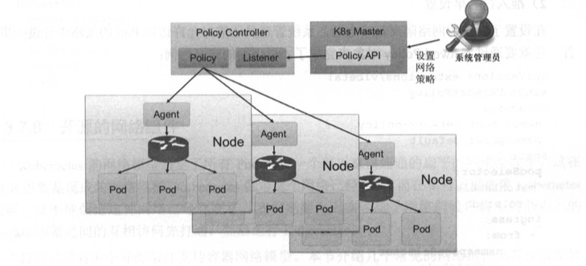

# Network Policy
实现细粒度的容器间网络访问隔离策略,Network Policy 的主要功能是对 Pod 间的网络通信进行限制和准入控制，设置方式为将Pod的 Label 作为查询条件， 设置允许访问或禁止访问的客户端 Pod 列表；目前查询条件可以作用于 Pod 和 Namespace 级别 。

- NetworkPolicy:供用户设 置 Pod 间网络访问的策略
-  policy controller ：策略控制器，策略控制器由第三方 网络组件提供，目前 Calico、 Romana、 Weave、 OpenShift、 OpenContrail 等开源项目均支持网络策略的实现。

下图描述用policy controller 需要实现一个 API Listener，监 听用户设置的 NetworkPolicy定义，并将网络访问规则通过各 Node 的 Agent进行实际设置( Agent 则需要 CNI 网络插件实现)。


网络策略的设置包括网络隔离(禁止访问)和允许访问(白名单)两种方式:
- 网络隔离
  - 网络隔离需要在设置其他允许访问列表之前进行启用。
  - Namespace级别隔离，拒绝非Namespace的所有Pod,目前仅支持进入放的的网络访问Ingress
  - 网络隔离策略仅有 DefaultDeny,即到该 Namespace 中 Pod 的网络访问都被拒绝。
  ```
  设置 DefaultDeny 网络策略方式为给 Namespacedefault设置一个 annotation:
    kind : Namespace apiV ersion: vl metadata:
    name: default
    ann。tations : net.beta.kubernetes.io/network-policy: |
    {
        "ingress":{
            "isolation" : "DefaultDeny"
        }
    }
  ```
- 准入白名单设置
  在设置了默认的网络隔离策略之后，系统管理员还需对允许访问 Pod 的策略进行进一步设 置，这就要通过 NetworkPolicy对象来完成了,例子：
  ```
    apiVers工on : extensions/vlbetal kind : NetworkPolicy
    metadata :
    name: test-network-policy
    Namespace: default 
    spec :
        //用于定义后面 Ingress 策略将作用的 Pod 范围，即网络访问的目标 Pod 范围 。
        podSelector:
        matchLabels: 
            role: db
        //定义可 以访问目标 Pod 的白名单策略，满足企om 条件的客户端才能访问 ports 定义 的目标 Pod 端口 号。
        ingress: 
        //对符合条件的客户端 Pod 进行网络放行，可以基于客户端 Pod 的 Label 或 客户端 Pod 所在的 Namespace 的 Label 进行设置。
        - from:
            - namespaceSelector: 
                matchLabels:
                    project: myproject 
            - podSelector:
                matchLabels : 
                role : frontend
          // 可访问的目标 Pod 监听的端口号。
          ports:
            - protocol: tcp 
            port : 6379
  ```