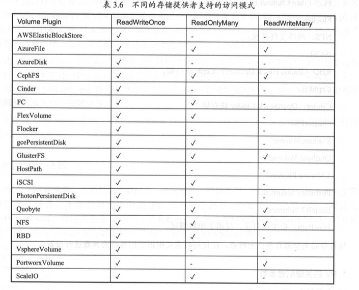
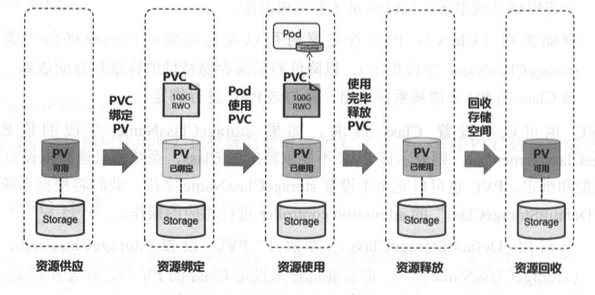
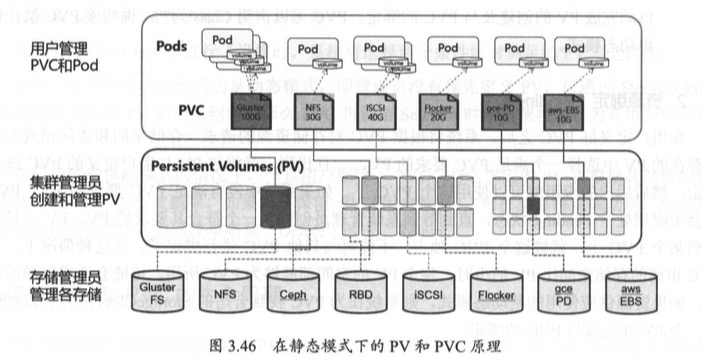
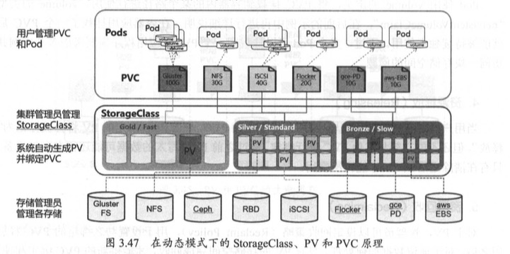

# 共享存储原理-PV&PVC
PersistentVolume和 PersistentVolumeClaim两个资源对象来实现对存储的管理子系统。
- PV 对底层网络共享存储的抽象，将共享存储定义为一种“资源”
  - PV 由管理员进行创建和配置，它与共享存储的具体实现直接相关，例如 GlusterFS、 iSCSI、阻D 或 GCE/AWS 公有云提供的共享存储 ，通过插件式的机制完成与共享存储 的对接，以供应用访问和使用
- PVC :是用户对于存储资源的一个“申请”，PVC会“消费” PV资源，PVC可以申请特定的存储空间和访问模式。
- StorageClass ：用于标记存储资源的特性和性能，存储卷的按需创建

## PV
PV作为抽象资源，主要包括存储能力、访问模式、存储类型、回收策略、后端存储类型 等 关键信息的设置
k8s支持的PV类型：
- gcePersistentDisk: GCE 公有云提供的 PersistentDisk。
- AWSElasticBlockStore: AWS 公有云提供的 ElasticBlockStore.
- AzureFile: Azure 公有 云提供的 File。
- AzureDisk: Azure 公有 云提供 的 Disk。 
- FC (Fibre Channel)。
- Flocker。
- NFS:网络文件系统。
- iSCSI .
- RBD (RadosBlockDevice):Ceph块存储。
- CephFS 。
- Cinder: OpenStack Cinder块存储 。
- GlusterFS 。
- VsphereVolume。
- Quobyte Volumes。
- VMware Photon。
- Portworx Volumes。
- ScaleIO Volumes。
- HostPath:宿主机目录，仅用于单机测试。

### PV的关键配置参数
- Capacity：描述存储设备具备的能力
- Access Modes ：描述用户应用对存储资源的访问的权限
  - ReadWriteOnce： RWO，:读写权限，并且只能被单个 Node 挂载 。
  - ReadOnlyMany ：ROX，只读权限，允许被多个Node挂载。
  - ReadWriteMany：RWX 读写权限，允许被多个 Node挂载。
  
- Class :设定其存储的类别
  - 有特定“类别”的 PV 只能与请求了该“类别”的 PVC 进行绑定
  - 未设定“类 别”的 PV 则只能与不请求任何“类别”的 PVC 进行绑定
- Reclaim Policy :回收策略
  - Retain :保留数据，需要手工处理 。
  - Recycle :简单清除文件的操作(例如执行 rm-rf/thevolume/*命令)。
  - Delete : 与PV相连的后端存储完成 volume的删除操作(如 AWSEBS、GCEPD、Azure Disk、 OpenStack Cinder 等设备的内部 volume 清理)。
### PV 生命周期的各个阶段( Phase)
- Available:可用状态，还未与某个 PVC 绑定。
- Bound: 己与某个 PVC 绑定。
- Released: 绑定的 PVC 己经删除，资源己释放 ，但没有被集群回收 。
- Failed:自动资源回收失败。
### Mount Options
PV 挂载到一个 Node 上时,根据后端存储的特点 ，可能需要设置额外的挂载参数，,通过在PV的定义中，设置一个名为“ volume.beta.kubemetes.io/mount-options” 的 annotation 来实现。
例子对一个类型为 gcePersistentDisk 的 PV 设置了挂载参数“ discard飞
```
apiVersion: "vl"
kind: "PersistentVolume"
metadata:
    name: gce-disk-1 
    annotations:
        volume.beta.kubernetes.io/mount-options: "discard"
spec:
  capacity:
  storage: "10Gi"
  accessModes:
   - "ReadWriteOnce"
  gcePersistentDisk:
    fsType: "ext4"
    pdName: "gce-dis-1"
```
Kubemetes vl.6 版本开始，以下存储类型支 持设置挂载参数:
- gcePersistentDisk。
- AWSElasticBlockStore。
- AzureFile。
- AzureDisk。
- NFS。
- iSCSI。
- RBD (Rados Block Device): Ceph 块存储。
- CephFS 。
- Cinder: OpenStack 块存储 。
- GlusterFS。
- VsphereVolume 。
- QuobyteVolumes.
- VMware Photon。
## PVC
PVC 作为用户对存储资源的需求申请，主要包括存储空间请求、访问模式、 PV 选择条件和存储类别等信息的设置.
例子申请 8Gi 存储空间，访问模 式为“ReadWriteOnce飞 PV选择条件为包含标签“release=stable”并且包含条件为“environment In [dev]”的标签，存储类别为“ slow”：
```
kind: PersistentVolumeClaim 
apiVersion: v1
metadata:
  name: myclaim
spec:
  accessModes:
   - ReadWriteOnce
    resources:
     requests:
       storage: 8Gi 
    storageClassName: slow
    selector:
      matchLabels: 
        release:”stable”
      matchExpressions:
        - {key : environment , operator : In, values : [dev]}
```

PVC 的关键配置参数说明如下:
- Resources:描述对存储资源的请求,目前仅支持 request.storage 的设置存储空间大小
- Access Modes：用于描述用户应用对存储资源 的访问权限 。可以设置 的三种访问模式与 PV 的设置相同 。
- Selector：通过 Label Selector 的设置，可使 PVC 对于系统中己存在的 各种 PV 进行筛选。
- Class：PVC 在定义 时可以设定 需要 的后端存储的“ 类 别” (通过 storageClassName 字段指定)，以降低对后端存储特性的详细信息的依赖 。只有设置了 该 Class 的 PV 才能被系统选出，井与该 PVC 进行绑定。


## PV 和 PVC 的生命周期
PV 可以 看作可用的存储资源， PVC 则是对存储资源的需求， PV 和 PVC 的相互关系遵循


### Provisioning
创建好PV,目前支持供应模式：
- Static：集群管理员手工创建许多 PV，在定义 PV 时需要将后端存储的特性进行设置。
  
  

- Dynamic：通过 StorageClass 的设置对后端存储进 行描述，标记为某种“类型( Class)，系统自动完成PV的创建和PVC的绑定。PVC可以声明Class为””，说明该PVC禁止使用动态模式 。
  
  
### Binding
定义好PVC后，系统将根据 PVC 对存储资源的请求(存储空间和访问模式)在 己存在的 PV 中选择一个满足 PVC 要求的 PV：
- 找到 则就将该 PV 与用户定义的 PVC 进行 绑定，然后用户的应用就可以使用这个 PVC 了
- 找不到，则会无限期处于 Pending 状态，直到等到系统管理员创建了 一个符合其要求的 PV

PV 一旦绑 定到某个 PVC 上，就被这个 PVC 独占，不能再与其他 PVC 进行绑定了。因此：
- 当 PVC 申请的存储空间比 PV 的少时，整个 PV 的空间都能够为 PVC 所用
- 如果资源供应使用的是动态模式，则系统在为 PVC 找到 合适的 StorageClass 后，将自动创建一个 PV 井完成与 PVC 的绑定。

### Using
Pod 使用`volume`则将PVC挂载到容器内的某个路径进行使用，类型为`persistentVolumeClaim`
### Releasing
使用完毕可以删除PVC,与之绑定的PV被标记为`Released`,当PV还不能与其他PVC进行绑定，只有完全清楚存留数据后才可以
### Reclaiming
根据回收策略，处理释放PVC后，遗留数据处理方式

## StorageClass
StorageCJass 作为对存储资源的抽象定义，对用户设置的 PVC 申请屏蔽后端存储的细节， 一方面减轻用户对于存储资源细节的关注，另一方面也减轻了管理员手工管理 PV 的工作，由 系统自动完成 PV 的创建和绑定， 实现了动态的资源供应。
定义：名称、后端存储的提供者 (Provisioner)和后端存储的相 关参 数配置。例子：
```
kind: StorageClass 
apiVersion: storage.k8s.io/v1 
metadata:
name: standard
provisioner: kubernetes.io/aws-ebs 
parameters:
  type: gp2
```
StorageClass 一旦被创建出来，将无法修改。如 需更改，则只能删除原 StorageClass 的定义重建。

### 关键配置参数
1. Provisioner： 描述存储资源的提供者,后端存储驱动，以“kubemetes.io/” 为开头；也可以自定义，只需要符合StorageClass的用法。
自定义 Provisioner 需要符合[存储卷的开发规范](https://github.com/kubernetes/cornrnunity/blob/master/contributors/design-proposals/volume-provisioning.md)

2. Parameters
    后端存储资源提供者的参数设置，不同的 Provisioner包括不同的参数设置。目前支持参数：
    - AWSEBS存储卷
      - type: 可选项为io1， gp2, scl, stl， 默认值为gp2
      - zone: AWSzone的名称。
      - iopsPerGB: 仅用于 io1 类型 的 volume，意为每秒每 GiB 的 1/o 操作数量 。
      - enc叨 ted: 是否加密。
      - kmsKeyld:加 密 时的 Amazon Resource Name。
        ```
        //例子
        kind: StorageClass 
        apiVersion: storage.k8s.io/v1
        metadata:
          name: slow 
        provisioner: kubernetes.io/aws-ebs
        parameters:
          type: io1
        ```
    - GCEPD存储卷
      - type: 可选项为 pd-standard、 pd-ssd，默认值为 pd-standard。
      - zone: GCEzone名称。
        ```
        // 例子
        kind : StorageClass
        apiVersion: storage.kBs.io/v1 
        metadata:
          name : slow
        provisioner: kubernetes.io/gce-pd
        parameters :
          type : pd-standard 
          zone : us-centrall-a
        ```
    - GlusterFS 存储卷
       - resturl: Gluster REST 服 务 CHeketi) 的 URL 地址，用 于自动完 成 GlusterFSvolume 的设置。
       - restauthenabled:是否对 Gluster阻ST服务启用安全机制。
       - restuser:访问 Gluster REST 服务的用户名 
       - secretNamespace和 secretName:保存访问 Gluster阻ST服务密码的 Secret资源对象名。
       - clusterid: GlusterFS 的 Cluster ID。
       - gidMin和 gidMax:StorageClass的 GID范围，用于动态资源供应时为 PV设置的 GID。
       - volumetype: GlusterFS 的 volume 类型设置，例 如 replicate:3 (Replicate 类型， 3 份副本):disperse:4:2 (Disperse类型，数据4份，冗余2份:“none”(Distribute类型)。
        ```
        apiVersion: storage.kBs.io/v1 
        kind: StorageClass
        metadata:
          name: slow
        provisioner : kubernetes.io/glusterfs 
        parameters:
          resturl: "http://127.0.0.1:8081"
          clusterid: "630372ccdc720a92c68lfb928f27b53f" 
          restauthenabled: "true"
          restuser: "admin"
          secretNamespace: "default" 
          secretName:"heketi-secret"
          gidMin: "40000"
          gidMax: "50000"
          volumetype: ”replicate:3"
        ```
    - OpenStackCinder存储卷
      - type: Cinder 的 VolumeType，默认值为空。
      - availability: Availability Zone，默认值为空。
      ```
      kind: StorageClass
      apiVersion: storage.k8s.io/v1
      metadata: 
        name: gold
      provisioner: kubernetes.io/cinder
      parameters:
        type: fast 
        availability: nova
      ```
3. 