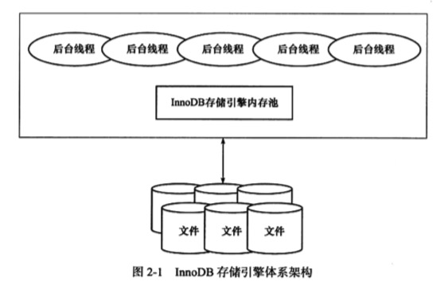
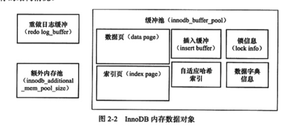

# InnoDB
InnoDB存储引擎，mysql5.5版本开始默认作为表存储引擎，是第一个完整支持ACID事务的MYSQL引擎：
- 行锁设计
- MVCC
- 外键
- 提供一致性非锁定读

## 体系架构



InnDB存储引擎有多个内存块，组成内存池，其主要工作：
- 维护所有进程/线程需要访问的多个内部数据结构
- 缓存磁盘上的数据，方便快速地读取，同时缓存对在磁盘文件修改之前的数据
- redo log

## 后台线程
- Master Thread
  - 核心线程
  - 负责缓冲池数据异步刷新到磁盘
  - 保证数据一致性，包括脏页的刷新，合并插入缓冲（INSERT BUFFED）
  - UNDO 页的回收
- IO Thread
  - 负责AIO请求的回调处理
  - 1.0版本之前有4个IO Thread:write,read,insert buffer 和log IO thread。
  - Linux 下 IO Thread数量不能进行调整，widnows平台可以通过`innodb_file_io_threads`来增大
  - 1.0.x之后，read thread 和write thread 分别增加到4个，使用`innodb_read_io_thread`和`innodb_write_io_threads`来设置
  - read thread ID总是小与 write thread ID
- Purge Thread
  - 回收分配的undo页
  - 1.1版本之前，purge 在 Master Thread中
  - 1.1版本开始，单独完成
  - 配置文件启用单独线程方式：
  ```
  [mysqld]
  innodb_purge_threads=1
  ```
  - 1.2开始，支持多个Purge Thread,进而加快undo页回收
- Page Cleaner Thread
  - 1.2之后引入，作用对脏页刷新操作，减轻Master Thread工作，以及用户查询线程的阻塞

## 内存
InnoDB存储引擎是基于磁盘存储，并将记录按页的方式进行管理，利用缓冲池技术提高数据库性能。
- 页FIX操作：从磁盘读取到页存储到缓冲池中，下次直接从缓冲池读取
- Checkpoint机制：数据库页修改操作，先修改缓冲池中页，然后以一定频率刷新到磁盘上

### 缓冲池
- 大小可通过参数`innodb_buffer_pool_size`来设置
- 缓冲数据页类型：
  - 索引页
  - 数据页
  - undo页
  - 插入缓冲（insert buffer）
  - 自适应哈希索引（adaptive hash index）
  - Innodb存储的锁信息（lock info）
  - 数据字典信息（data dictionary)
  - Flush 列表：脏页列表
- 1.0.x开始，运行多个缓冲池实例，每个页根据哈希平均分配到不同缓冲池中，减少并发带来的竞争
  - 通过`innodb_buffer_pool_instances`来配置实例多少
- Mysql5.6开始 通过`information_schema`下的表`INNODB_BUFFER_POOL_STATS`来观察缓冲状态
- 页大小默认`16KB`，1.0.x后支持压缩功能，可以压缩到1KB,2KB,4KB,8KB
- 脏页既存在LRU列表，也存在Flush列表


### LRU List,Free List和Flush List
缓冲池通过LRU算法来管理：
- 最频繁使用的页在LRU表前端，最少的在尾端
- 当缓冲池不能存储新读取的页时，先释放LRU列表尾端的页
- InnoDB优化传统LRU算法
  - midpoint insertion strategy：
    - 增加`midpoint`位置，该位置之后的称为old列表，之前的称为new列表
    - 新增页放在midpoint位置
    - 配置参数`innodb_old_blocks_pct`，默认为LRU长度的`5/8`
  - 解决查询返回多个页，但页并非热点数据，容易移除真正热点数据：
    - 新增参数`innodb_old_blocks_time`，标示页读取到mid位置后需要等待多久才会被放在new列表
- 数据库刚启动是，LRU列表为空：
  - 页都在Free列表中，需要从缓冲池分页时：
    - 从Free列表中查找是否有可用的空闲页，有则将该页从Free列表删除，存储在LRU列表中，否则根据LRU算法，淘汰LRU列表末尾的页，将空间分给新的页。
  - 当页从old表加入到new时为`page made young`操作：
  - 当页因为innodb_old_blocks_time设置导致未能加入到new时称为`page not made young`
- 可以通过`SHOW ENGINE INNODB STATUS`来观察LRU和Free表的使用情况和状态
- 1.2版本开始，可以通过表`INNODB_BUFFER_PAGE_LRU`来观察每个LRU列表中每个页的具体信息
- 对页大小非16KB的，通过`unzip_LRU`列表管理：
  - 对存在表页大小不一致时：
    - 对不同压缩页大小进行分别管理
    - 通过伙伴算法进行内存分配（x 可选 2，4，8）：
      - 需要申请`xKB`大小页时
      - 检查`xKB`的unzip_LRU列表是否有空闲页
      - 有则直接使用
      - 没有则检查`2xKB`的unzip_LRU列表：
        - 得到足够的空闲页，则将页分成2个`xKB`页，存放在`xKB`的unzip_LRU列表
        - 不能则，申请`4xKB`的页，将页分1个`2xKB`的，2个`xKB`的，分别存储在对应的unzip_LRU列表
  - 通过`information_schema`的表`INNODB_BUFFER_PAGE_LRU`查看unzip_LRU列表的页
- 查看LRU中脏表语句`select TABLE_NAME,SPACE,PAGE_NUMBER,PAGE_TYPE FROM INNODB_BUFFER_PAGE_LRU WHERE OLDEST_MODIFICATION>0;` TABLE_NAME为NULL标示页属于系统表空间。
- 释放LRU上的脏页时，强制执行Checkpoint算法，刷新页信息到磁盘

Flush List管理
  - 管理页将刷新到磁盘，CHECKPOINT机制使用
  - 可以通过`SHOW ENGINE INNODB STATUS`来观察Flush List，`Modfied db pages xxx`代表脏页数量
### 重做日志缓冲-redo log buffer
InnoDB存储引擎先将重做日志信息存放到redo log buffer，然后按一定频率刷新到重做日志文件：
- `innodb_log_buffer_size`控制缓冲大小，默认：8MB；只需要保证每秒产生的事务量在这个大小之内即可
- 重做日志缓冲刷新到重做日志文件情况：
  - Master Thread 每秒将重做日志缓冲刷新到重做日志文件
  - 每个事务提交时将重做日志缓冲刷新到redo log 文件
  - 当重做日志缓冲剩余空间小于1/2时


### 额外的内存池
InnoDB存储引擎中，对内存管理时通过内存堆方式进行，对一些数据结构本身的内存分配时，需要从额外的内存池中申请；当该区域内存不够时，会从缓冲池申请，这些数据结构有：
- 缓冲池中的帧缓冲（frame buffer）
- 缓冲控制对象 （buffer control block）:
  - LRU
  - 锁
  - 。。。

## Checkpoint 技术
主要解决以下问题：
- 缩短数据库恢复时间
- 缓冲池不够时，将脏页刷新到磁盘
- 重做日志不可用时，刷新脏页

### LSN策略
页使用LSN(Log Sequence Number)来标志版本，本身是8字节的数字。

通过`SHOW ENGINE INNODB STATUS`观察。LSN类型：
- redo_lsn: 标示写入到重做日志的页
- checkpoint_lsn：标示刷新回磁盘的最新的页

### Write Ahead Log 策略
当事务提交时，先写重做日志，再修改页，达到持久性(D)的要求，避免数据丢失

### Checkpoint类型
- Sharp Checkpoint
  - 发生在数据库关闭时，刷新所有脏页回磁盘
  - 参数`innodb_fast_shutdown=1`
- Fuzzy Checkpoint
  - InnoDB存储引擎内部使用,每次只刷新部分脏页，发生情况：
    - Master Thread Checkpoint
    - FLUSH_LRU_LIST Checkpoint
      - 1.1.x之前，LRU列表需要满足100个可用空闲页，否则执行Checkpoint回收脏页，让出空间
      - 1.2.x开始，检查LRU空闲页放在`Page Cleaner Thread`,通过参数`innodb_lru_scan_depth`控制LRU可用数量，默认`1024`
    - Async/Sync Flush Checkpoint
    - Dirty Page too much Checkpoint
### Master Thread Checkpoint
按频率，异步刷新一定比例页回磁盘。[工作方式](./##MasterThread工作方式)看下面

### Async/Sync Flush Checkpoint
指重做日志文件不可用情况，需要刷新一部分页到磁盘，保证重做日志循环可使用。

通过命令`SHOW ENGINE INNODB STAUTS`来观察

#### Async/Sync Flush Checkpoint 操作机制
从脏页列表选取脏页，写入到重做日志的页LSN标记为redo_lsn，刷新回磁盘的最新页LSN记为checkpoint_lsn，则可以定义`checkpoint_age`：
```
checkpoint_age = redo_lsn - checkpoint_lsn
```
在定义以下变量：
- total_redo_log_file_size: 重做日志文件总大小，假设`NGB`
- async_water_mark = 75%total_redo_log_file_size
- sync_water_mark = 90%total_redo_log_file_size
  
利用上述变量进行判断是否进行Checkpoint:
1. 当`checkpoint_age < async_water_mark` 时，不需要刷新脏页到磁盘
2. 当`async_water_mark < checkpoint_age < sync_water_mark`时触发 Async Flush,从Flush列表中刷新足够的脏页回磁盘，使得满足`1`的条件
3. 当`checkpoint_age > async_water_mark`,即重做日志文件太小时，并进行类似LOAD DATA 的BULK INSERT操作，触发`Sync Flush`操作，从Flush列表中刷新足够的脏页回磁盘，使得满足`1`的条件
  
### Dirty Page too much Checkpoint
脏页太多，导致强制执行Checkpoint。可通过`innodb_max_dirty_pages_pct`控制脏页占用比例多少时，执行刷新动作

## Master Thread 工作方式
### 1.0.x之前
具有最高线程优先级，内部由多个循环组成：
- 主循环（loop）
- 后台循环 （backgroup loop）
- 刷新循环 （flush loop)
- 暂停循环（suspend loop)

根据数据库运行状态在：`loop`,`backgroup loop`,`flush loop`,`suspend loop`中切换。

### 主循环（loop）
两个操作：

每秒操作：
- 日志缓冲刷新到磁盘，即使事务未提交
- 可能合并插入缓冲:当前一秒内发送IO次数小于5次，则执行合并插入缓冲
- 可能至多刷新100个脏页到磁盘：判断缓冲池脏页比例是否超过配置参数
- 当没有用户活动时，切换到backgroup loop

每10秒操作：
- 可能刷新100个脏页到磁盘:10秒内IO少于200次下
- 合并至多5个插入到缓冲
- 将日志缓冲刷新到磁盘
- 删除无用的Undo页：判断当前事务系统中已经被删除的行是否可以删除，可以立即删除。每次操作最多尝试回收20个undo页
- 刷新100个或者10脏页到磁盘：判断缓冲池中脏页比例是否超过70%,有则刷新100个脏页，没有则刷新10的脏页

### 后台循环 （backgroup loop）
- 删除无用的Undo页
- 合并20个插入缓冲
- 跳回主循环
- 不断刷新100个页直到符合条件，可能跳转到flush loop完成，如果flush loop没有可操作，则切换到suspend_loop 将Master Thread 挂起，等待事件发生

### 伪代码
```
void master_thread(){
  loop:
  for(int i=0;i<10;i++){
    do log buffer flush to disk
    if (last_one_second_ios<5){
      do merge at most 5 insert buffer
    }
    if (buf_get_modified_ratio_pct > innodb_max_dirty_pages_pct){
      do buffer pool flush 100 dirty page
    }
    if (no user activety){
      go backgroud loop
    }
    sleep(1);
  }
  
  if (last_ten_second_ios < 200){
    do buffer pool flush 100 dirty page
  }
  do merge at most 5 insert buffer
  do log buffer flush to disk
  do full purge
  if (buf_get_modified_ratio_pct>70%){
    do buffer pool flush 100 dirty page
  } else {
    do buffer pool flush 10 dirty page
  }
  goto loop 
  backgroud loop:
  do full purge
  do merge 20 insert buffer
  if not idel
    goto loop;
  else
    goto flush loop;
  
  flush loop:
  do buffer pool flush 100 dirty page
  if (buf_get_modified_ratio_pct > innodb_max_dirty_pages_pct){
    goto flush loop;
    goto suspend loog;
  }

  suspend loop:
  suspend_thred()
  waiting event

  goto loop;
}
```
### 1.2.x之前
改变1.0.x之前的IO次数判断都是硬编码问题，提高参数`innodb_io_capacity`来标示磁盘IO的吞吐量，默认是200，对刷新到磁盘数量会按照innodb_io_capacity的百分比进行控制：
- 合并插入缓冲时，合并插入缓冲数量需大于为innodb_io_capacity值的5%;
- 从缓冲池刷新脏页时，刷新脏页的数量为innodb_io_capacity
  
调整`innodb_max_dirty_pages_pct` 默认值为75,保证IO性能，加快刷新频率

增加`innodb_purge_batch_size`龙之每次full purge回收Undo页的数量，默认20

增加`buf_flush_get_desired_flush_rate`函数来判断需要刷新脏页最合适的数量

#### 伪代码
```
void master_thread(){
  loop:
  for(int i=0;i<10;i++){
    do log buffer flush to disk
    if (last_one_second_ios<5%innodb_io_capacity){
      do merge 5%innodb_io_capacity insert buffer
    }
    if (buf_get_modified_ratio_pct > innodb_max_dirty_pages_pct){
      do buffer pool flush 100%innodb_io_capacity dirty page
    } else if enable adaptive flush{
      do buffer pool flush desired amount dirty page
    }

    if (no user activety){
      go backgroud loop
    }
    sleep(1);
  }
  
  if (last_ten_second_ios < innodb_io_capacity){
    do buffer pool flush 100%innodb_io_capacity dirty page
  }
  do merge 5%innodb_io_capacity insert buffer
  do log buffer flush to disk
  do full purge
  if (buf_get_modified_ratio_pct>70%){
    do buffer pool flush 100%innodb_io_capacity dirty page
  } else {
    do buffer pool flush 10%innodb_io_capacity dirty page
  }
  goto loop 
  backgroud loop:
  do full purge
  do buffer pool flush 100%innodb_io_capacity dirty page
  if not idel
    goto loop;
  else
    goto flush loop;
  
  flush loop:
  do buffer pool flush 100%innodb_io_capacity dirty page
  if (buf_get_modified_ratio_pct > innodb_max_dirty_pages_pct){
      goto flush loop;
    goto suspend loop;
  }

  suspend loop:
  suspend_thred()
  waiting event

  goto loop;
}
```

### 1.2.x开始
分离每秒和每10秒操作，分离刷新脏页的工作到Page Cleaner Thread
伪代码：
```
if innodb is idle
  // 之前版本的每10秒操作
  srv_master_do_idle_tasks();
else
  // 每秒操作
  srv_master_do_active_tasks();
```

## InnoDB关键特性
通过`SHOW ENGINE INNODB STATUS`可查看插入缓冲信息。
- Ibuf行开始， 
- size :代表已经合并记录的页数量
- `seg size` 显示当前Insert Buffer 大小
- Inserts 代表插入的记录数
- merged recs 代表合并插入记录数量
### 插入缓冲 Insert Buffer
本次Insert Buffer所指是物理页的一个组成部分。对非聚集索引的插入或更新操作：
- 先判断插入的页是否在缓冲池中，不在话则直接插入
- 不在则先放到Insert Buffer对象中，然后等待将其和辅助索引页节点进行合并操作
#### Insert Buffer使用需同时满足条件
- 索引是辅助索引 secondary index
- 非唯一索引：唯一的话，就需要进行离散读取比对发生，导致Insert Buffer失去意义

如若设计非唯一索引的数据大量写入，出现宕机，因为Inser Buffer为来得及合并，重启恢复时间会很长

Insert Buffer 存在问题：密集写入情况下，插入缓冲会占用过多缓冲池内存，默认可以占用到1/2

### Change Buffer
1.0.x引入，Insert Buffer的升级，对DML（INSERT，DELETE，UPDATE）操作都进行缓冲，分别为：Insert Buffer,Delete Buffer,Purge Buffer. `适用对象还是非唯一的辅助索引`。Insert Buffer 和之前一样

对UPDATE操作可能分成两个过程：
- 将记录标志为已经删除
- 真正删除记录
  
Delete Buffer对应第一个过程，标记为删除。Purge Buffer对应Update操作的第二个过程。

InnoDB存储引擎提供参数`innodb_change_buffering`来开启各种Buffer的选项，可选值：
- inserts : 启用Insert Buffer
- deletes：启用Delete Buffer
- purges：启用Purge Buffer
- changes : 启用insert 和deletes
- all :全部启用
- none：都不启用

参数`innodb_change_buffer_max_size`控制Change buffer 最大使用内存数量，默认25，表示缓冲池的1/4空间。

通过`SHOW ENGINE INNODB STATUS`可查看插入缓冲信息。
- merged operations
  - insert 表示Insert Buffer
  - delete mark 表示 Delete Buffer
  - delete 表示Purge Buffer
- discarded operation 表示发生merge,表被删除，无须合并记录

### Insert Buffer 内部实现
Insert Buffer数据结构是一棵B+树，Mysql4.1之前每张表单独一个B+树，现在由全局B+树负责对所有表的辅助索引进行Insert Buffer.存放在共享表空间，默认ibdata1。所以单独恢复表空间ibd文件的数据，会以CHECK TABLE失败，因为表辅助索引数据库在共享表空间。因此恢复ibd文件后还需进行`REPAiR TABLE`来重建表的辅助索引。

Insert Buffer 非叶节点存放查询的`search key`，其结构如下：
```
    0          4      5          9
    +----------+------+----------+
    |   space  |marker|  offert  |
    +----------+------+----------+
```
- 共占用9个字节
- space
  - 4字节
  - 表示带插入记录所在表的表空间id,每个表空间id都是唯一的，可以通过该id查询得知哪张表
- marker 
  - 1个字节，兼容老版本 Insert Buffer.
- offert
  - 4字节
  - 表示页所在的偏移量

一个辅助索引插入到页（space ,Offert）时：
- 在缓冲池则直接插入
- 不在缓冲池，构建search key，查找Insert Buffer这个棵B+树，将这条记录插入到Insert Buffer B+树的叶子节点中。

叶子节点的记录结构：
```
    0          4      5          9          14
    +----------+------+----------+----------+----------+----------+----------+
    |   space  |marker|  offert  | metadata |          |          |          |
    +----------+------+----------+----------+----------+----------+----------+
    |-----------非叶子结构含义一样-------------|------secondary index record----|
```
metadata 占用4个字节，存储如下：
- IBUF_REC_OFFSET_COUNT： 2个字节，整数，用来排序每个记录进来的Insert Buffer的顺序，通过这个值顺序回放（replay）才能得到记录的正确值
- IBUF_REC_OFFSET_TYPE: 1个字节
- IBUF_REC_OFFSET_FLAGE: 1个字节

叶子节点记录额外13个字节存放而外信息后面才是真正记录数据。

#### Insert Buffer Bitmap
页Insert Buffer Bitmap `用来记录每个辅助索引页（space,page_no）的可用空间`。在启用Insert Buffer索引后，该辅助索引页可能被插入到Insert Buffer B+树中。Insert Buffer Bitmap 页可以保证每次成功合并Insert Buffer页。

- 每个Insert Buffer Bitmap页用来追踪16384个辅助索引页.（256个区）
- 每个Insert Buffer Bitmap都在16384个页后的第二个页中

Insert Buffer Bitmap，占用4位，其内容如下：
- IBUF_BITMAP_FREE ：2位，表示辅助索引页中可用空间数，值为：
  - 0 表示无可用空间
  - 1 剩下空间大于1/32页（512字节）
  - 2 剩余空间大于1/16页
  - 3 剩余空间大于1/8页
- IBUF_BITMAP_BUFFERED ：1位，1表示辅助索引页有记录被缓存在Insert Buffer B+树中
- IBUF_BITMAP_IBUF： 1位，1表示该页位Insert Buffer B+树的索引页

#### Merge Insert Buffer
Merge Insert Buffer 可能发生情况：
- 辅助索引页被读取到缓冲池时 : 检查到Insert Buffer Bitmap中有记录存放在Insert Buffer B+树中，则将这些记录插入到辅助索引页中。
- Insert Buffer Bitmap页追踪到该辅助索引已无可用空间时：少于1/32页时，强制进行合并操作
- Master Thread，每秒或10秒的合并操作，具体情况请查看上面[Master Thread工作方式](./##MasterThread工作方式)

### 两次写入 Double Write
### 自适应哈希索引 Adaptive Hash Index
### 异步 IO Async IO
### 刷新邻接页 Flush Neighbor Page