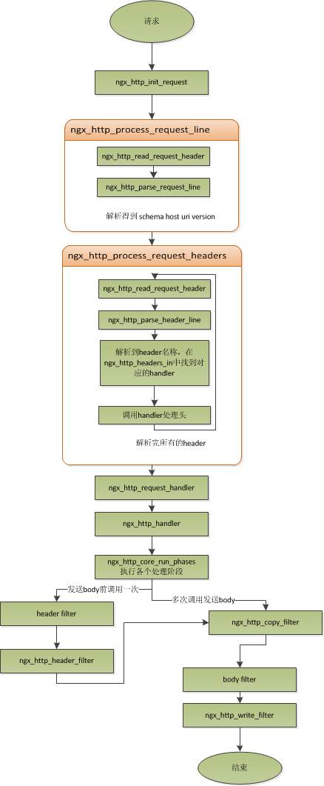

# connection
nginx中connection就是对tcp连接的封装，其中包括连接的socket，读事件，写事件.

## 连接
### 如何处理一个连接
- 结合tcp连接的生命周期
    - nginx在启动时，解析配置文件，得到监听端口和ip地址
    - 在master进程中，初始化好这个监控socket
        - 创建socket
        - 设置addreuse等选项
        - 绑定指定ip地址端口
        - 再listen
    - 再fork多个子进程worker,让子进程竞争accept新的连接
    - 最后客户端请求通过三次握手建立连接，其中一个worker竞争到accept,得到这个建立好的连接socket
    - 创建nginx对连接的封装结构体，`ngx_connection_t`
        - 不管是来自客户端的，或者请求其他server的都封装在ngx_connection_t
        - 作为客户端
            - nginx先获取一个ngx_connection_t
            - 创建socket,设置socket属性，例如是否阻塞
            - 通过读写事件，调用connect/read/write来调用连接
            - 最后关闭连接，释放ngx_connection

### 管理连接
- worker_connections
单个进程支持的最大连接数
    - 如果该值大于nofile，那么实际的最大连接数是nofile，nginx会有警告
    - 每个worker进程都有一个独立的连接池来管理连接，大小为**worker_connections**
        - 连接池里面保存则对连接的封装结构 **ngx_connection_t**数组
        - nginx会通过一个链表free_connections来保存所有的空闲ngx_connection_t
- nginx最大连接数
```
worker_connections * worker_processes
```
- 作为http反向代理，最大连接数
因为作为反向代理服务器，每个并发会建立与客户端的连接和与后端服务的连接，会占用两个连接。
```
worker_connections * （worker_processes/2）
```

### 解决进程竞争accept不均衡问题
>“当accept到一个新的tcp连接后，因为无法得到空闲连接，而且无法将此连接转交给其它进程，最终会导致此tcp连接得不到处理，就中止掉了。很显然，这是不公平的，有的进程有空余连接，却没有处理机会，有的进程因为没有空余连接，却人为地丢弃连接。”
- nginx的处理先打开accept_mutex选项
- 只有获得accept_mutex互斥量的进程才能添加accept
- nginx使用一个叫ngx_accept_disabled的变量来控制是否去竞争accept_mutex锁

### 计算ngx_accept_disabled伪代码

- 计算ngx_accept_disabled的值,nginx单进程的所有连接总数的八分之一，减去剩下的空闲连接数量
- 当剩余连接数小于总连接数的八分之一时，其值才大于0，而且剩余的连接数越小，这个值越大。
- 当ngx_accept_disabled大于0时，不会去尝试获取accept_mutex锁，并且将ngx_accept_disabled减1，就是等于让出获取连接的机会
- 每次执行到此处时，都会去减1，直到小于0
- 当空余连接越少时，ngx_accept_disable越大越不会获取accept_mutex

```
ngx_accept_disabled = ngx_cycle->connection_n / 8
    - ngx_cycle->free_connection_n;

if (ngx_accept_disabled > 0) {
    ngx_accept_disabled--;

} else {
    if (ngx_trylock_accept_mutex(cycle) == NGX_ERROR) {
        return;
    }

    if (ngx_accept_mutex_held) {
        flags |= NGX_POST_EVENTS;

    } else {
        if (timer == NGX_TIMER_INFINITE
                || timer > ngx_accept_mutex_delay)
        {
            timer = ngx_accept_mutex_delay;
        }
    }
}
```

## request
### 正常处理请求步骤
- 建立好连接后，客户端发送请求过来后
- 读取一行数据，分析请求行中包含的**method,uri,http_version**信息
- 再一行行处理请求头，根据method与请求头的信息决定是否有请求体和请求体长度
- 如果有，则读取请求体，处理请求产生数据并输出数据，生成响应行，响应体，发回给客户端。完成一次完整的请求

### nginx如何处理请求
#### worker 层面
所有的请求都在worker上进行，ngx_worker_process_cycle() 是一个死循环函数，其流程上

- 操作系统提供的机制（例如epoll, kqueue等）产生相关的事件。
- 接收和处理事件，接受数据后封装成request对象
- 处理request的header和body
- 完成request的处理
- 重新初始化定时器及其他的事件

#### request请求的处理流程

- 初始化HTTP Request（读取来自客户端的数据，生成HTTP Request对象，该对象含有该请求所有的信息）。
- 处理请求头。
- 处理请求体。
- 匹配处理模块，如果有的话，调用与此请求（URL或者Location）关联的handler
- 依次调用各个phase handerler进行处理

#### request请求的处理详细层面
nginx把http请求封装在结构体**ngx_http_request_t**；通过ngx_http_request_t保存解析请求并输出相应数据


* 请求在ngx_http_init_request函数开始
* 设置读事件为**ngx_http_process_request_line**，处理请求行
    * 通过ngx_http_read_request_header来读取请求行数据
    * 调用ngx_http_parse_request_line函数来解析请求行
        * nginx为提高效率，采用状态机来解析请求行
        * 比较method时用4字一个整形操作，减少cpu指令
* 解析完请求后，设置读事件——**ngx_http_process_request_headers**，进行后续的读取和解析
    * ngx_http_process_request_headers解析请求头，与请求行一样
        * 通过ngx_http_read_request_header来读取请求头，
        * ngx_http_parse_header_line来解析一行请求头
        * 请求头保存到ngx_http_request_t的域headers_in中，header_in为链表，保存所有的请求头。
        * 在ngx_http_headers_in这个hash表中查找对应的请求处理函数。
            * 记录着头和请求处理函数的映射表。初始化时生成的
* 但解析到两个回车换行符时，表示请求头结束，则调用ngx_http_process_request处理请求体。
    * ngx_http_process_request会设置当前的连接的读写事件处理函数为ngx_http_request_handler
        * 当前事件是读事件还是写事件
        * 读事件对应ngx_http_request_t中的read_event_handler
        * 写事件对应ngx_http_request_t中的write_event_handler
    * 再调用ngx_http_handler来真正开始处理一个完整的http请求
        * 开始读取请求时，设置write_event_handler为ngx_http_core_run_phases，并执行
        * ngx_http_core_run_phases这个函数将把一个请求分成多阶段处理
            * 产生的响应头会放在ngx_http_request_t的headers_out中
            * 最后会调用filter来过滤数据，对数据进行加工，如truncked传输、gzip压缩等

#### phase handler
请求处理若干个阶段的模块处理，多个模块时，是依次处理。一个phase handler 通常执行以下几种任务：

- 匹配location
- 产生适当的响应
- 发送respone header
- 发送respone body


#### 读取到一个HTTP Request的header的时候的11个处理阶段

* NGX_HTTP_POST_READ_PHASE 读取请求内容阶段
* NGX_HTTP_SERVER_REWRITE_PHASE Server请求地址重写阶段
* NGX_HTTP_FIND_CONFIG_PHASE: 只有nginx core能执行 配置查找阶段:
* NGX_HTTP_REWRITE_PHASE Location请求地址重写阶段
* NGX_HTTP_POST_REWRITE_PHASE 请求地址重写提交阶段
* NGX_HTTP_PREACCESS_PHASE 访问权限检查准备阶段
* NGX_HTTP_ACCESS_PHASE 访问权限检查阶段
* NGX_HTTP_POST_ACCESS_PHASE 访问权限检查提交阶段
* NGX_HTTP_TRY_FILES_PHASE 配置项try_files处理阶段
* NGX_HTTP_CONTENT_PHASE 内容产生阶段
* NGX_HTTP_LOG_PHASE 日志模块处理阶段

#### NGX_HTTP_CONTENT_PHASE阶段的注意事项

- 能通过location匹配到对应合适的content handler,则交给它处理，这样的模块有
    - perl
    - flv
    - proxy_pass
    - mp4
- 如果没有直接的content handler,则会尝试
    - location有 random_index on 则随机选择一个文件发送给客户端
    - location有 index指令，则发送index指向的文件给客户端
    - location有 autoindex on指令,那么就发送请求地址对应的服务端路径下的文件列表给客户端。
    - location上有设置gzip_static on,则就查找是否有对应的.gz文件存在，有的话，就发送这个给客户端（客户端支持gzip的情况下）
    - 请求的URI如果对应一个静态文件，static module就发送静态文件的内容到客户端。
 
#### NGX_HTTP_CONTENT_PHASE之后输出模块会被传递给filter模块
filter模块也是与location相关的。所有的fiter模块都被组织成一条链。输出会依次穿越所有的filter，直到有一个filter模块的返回值表明已经处理完成。常见的filter模块

- server-side includes
- XSLT filtering
- 图像缩放之类的
- gzip压缩

有几个filter模块需要关注一下，调用顺序如下

* write:	写输出到客户端，实际上是写到连接对应的socket上。
* postpone:	这个filter是负责subrequest的，也就是子请求的。
* copy:	将一些需要复制的buf(文件或者内存)重新复制一份然后交给剩余的body filter处理。

## keepalive
如果知道每个请求头与响应体的长度，则可以在一个连接上执行多个请求，这就是长连接。
### http协议中响应body长度定义

1. http1.0
    1. 如果响应头中有content-length头，则以content-length的长度。
    2. 没有content-length头，则客户端会一直接收数据，直到服务端主动断开连接，才表示body接收完了
2. http1.1
    1. 如果响应头中的Transfer-encoding为chunked传输，则表示body是流式输出，，每块的开始会标识出当前块的长度，不需要body长度完成请求。
    2. 如果是非chunked传输，而且有content-length，则按照content-length来接收数据。
    3. 如果是非chunked，并且没有content-length，则客户端接收数据，直到服务端主动断开连接。
### nginx中的操作
除了http1.0不带content-length以及http1.1非chunked不带content-length外，body的长度是可知的情况下，nginx保持长连接操作如下

1. 客户端方面
    1. 请求头中的connection为close，则表示客户端需要关掉长连接
    2. 如果为keep-alive，则客户端需要打开长连接
    3. 如果客户端的请求中没有connection这个头，那么根据协议，如果是http1.0，则默认为close；如果是https1.1,默认是keep-alive。
    4. 如果结果为keepalive，会设置为长连接，同时也会设置最大等待时间，可通过keepalive_timeout来配置；为0则关闭。无论http协议版本为多少，超时了都会被强制关闭
    
2. 服务器方面
    1. 服务端是keepalive打开，响应的http头里面，也会包含有connection头域，其值是”Keep-Alive”，否则就是”Close”。
    2. 如果connection值为close，那么在nginx响应完数据后，会主动关掉连接。

### pipe
http1.1引入的新特性，视为keepalive的升华。基于长连接，目的就是利用一个连接做多个请求
#### 和keepalive区别
客户端提交多个请求下两者的操作如下

1. keepalive
    1. 第二个请求，必须要等到第一个请求的响应接收完全后，才能发起。得到两个响应的时间至少为`2 * RTT`
2. pipe
    1. 客户端不必等到第一个请求处理完后，就可以马上发起第二个请求。得到两个响应的时间可能能够达到1*RTT
#### nginx对pipe支持

1. 直接支持，但是不是并行处理多个请求
2. 在处理第一个请求的时候，客户端就可以发起第二个请求。借机减少等待第二个请求头数据时间。
3. 原理
    1. nginx在读取数据时，会将读取的数据放到一个buffer里面
    2. 如果nginx在处理完前一个请求后，如果发现buffer里面还有数据，就认为剩下的数据是下一个请求的开始，然后就接下来处理下一个请求，否则就设置keepalive。

### ingering_close
延迟关闭连接
